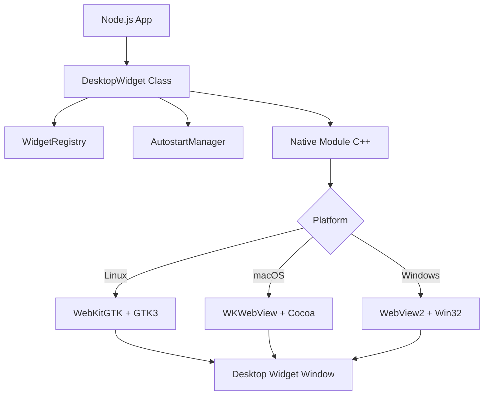

# Modern MDtoWeb Arayüz Testi

Bu doküman, yenilenen **MDtoWeb** arayüzünün tüm özelliklerini test etmek için hazırlanmıştır. Arayüz artık daha mobil uyumlu, minimalist ve ferah.

## 🚀 Yeni Özellikler

- **Gelişmiş Mobil Deneyim**: Kayan yan menü ve akıllı başlık alanı.
- **Kutulardan Arınmış Tasarım**: İçerik artık "box" içine hapsedilmiyor, geniş alanın tadını çıkarıyor.
- **Sabit Kontroller**: Tema değiştirici sağ alt köşede her zaman elinizin altında.

### 🛠️ Teknik Bileşenler

Aşağıdaki liste, hiyerarşik ağaç yapısını test etmek içindir:

- **Frontend Teknolojileri**
  - HTML5 & Modern CSS (Variables)
  - Tailwind CSS (Typography Plugin)
  - Bootstrap Icons
- **Backend Servisleri**
  - Node.js Core
  - JSDOM Integration
  - Prism.js Syntax Highlighting

### 💻 Kod Bloğu Testi

Kod blokları artık daha temiz bir başlık alanına ve kopyalama butonuna sahip:

```javascript
// Tema değiştirme mantığı
const toggleTheme = () => {
  const isDark = document.documentElement.classList.toggle('dark');
  localStorage.setItem('theme', isDark ? 'dark' : 'light');
  console.log('Tema değiştirildi:', isDark ? 'Koyu' : 'Açık');
};
```

### 📊 Tablo & Şık Path Testi

Tablolar modernist ve okunaklı, dosya yolları otomatik olarak şık birer etikete (badge) dönüşüyor:

| Bileşen | Dosya Yolu | Açıklama |
| :--- | :--- | :--- |
| Core Logic | src/services/convertFile.js | Ana dönüştürme mantığı. |
| Template | consts/templates/navigation_link.html | Responsive şablon dosyası. |
| Style | consts/templates/basic.css | Genel stil tanımları. |
| Parser | services/MarkdownParser.js | Markdown işleme motoru. |

| Özellik | Durum | Açıklama |
| :--- | :---: | :--- |
| Responsive | ✅ | Mobilde kusursuz çalışır. |
| Karanlık Mod | ✅ | Göz yormayan Slate paleti. |
| Full Width | ✅ | Kutulardan arındırılmış tasarım. |

---

> "Tasarım sadece nasıl göründüğü değil, nasıl çalıştığıdır." - Steve Jobs

### ✅ Yapılacaklar Listesi

- [x] Temiz kod yapısı
- [x] Mobil uyumluluk testi
- [ ] Kullanıcı geri bildirimleri
- [x] Performans optimizasyonu

### 📊 Mermaid Diyagram Testi

Mermaid diyagramları artık otomatik olarak render edilir:



---
*MDtoWeb ile sevgiyle yapıldı.*
